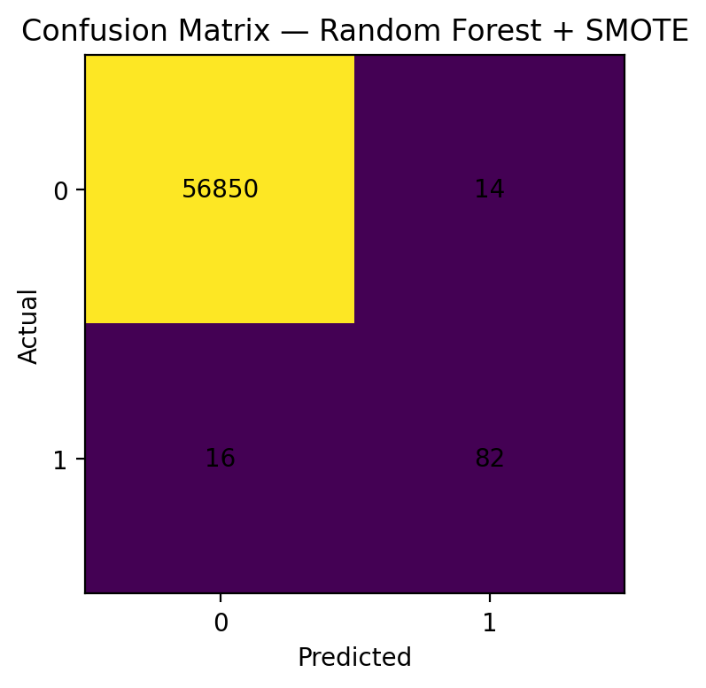
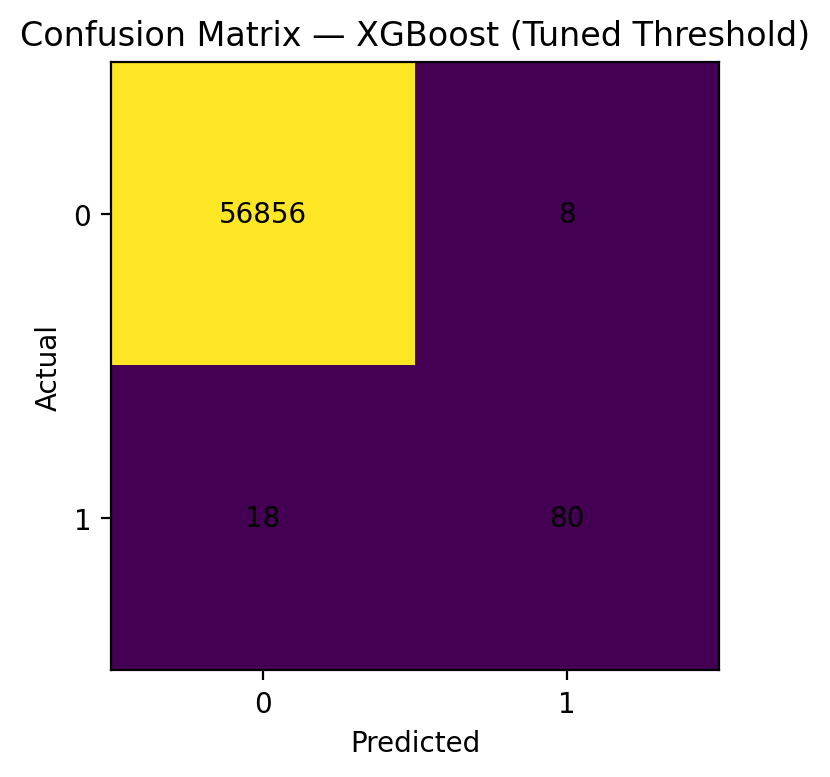
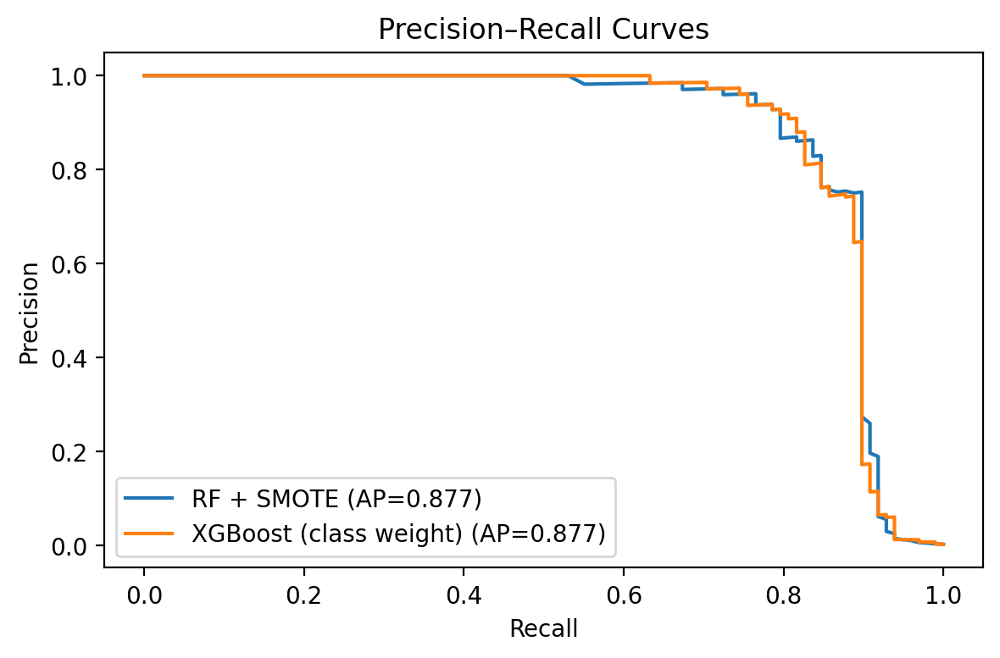
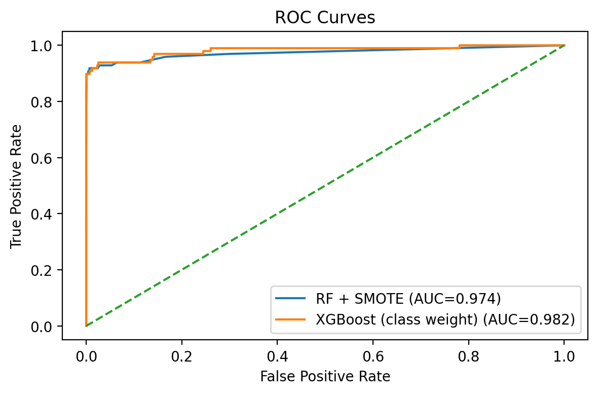
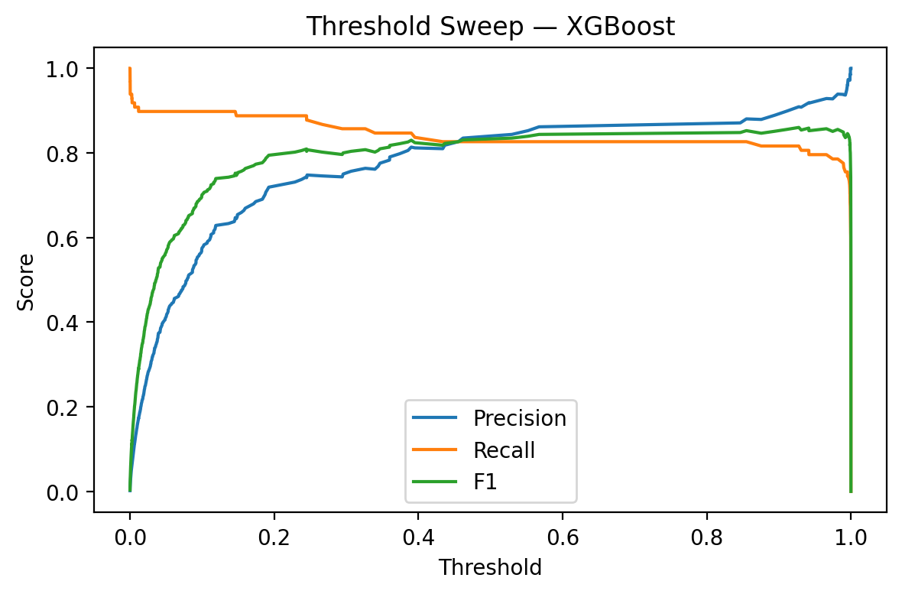

# Credit Card Fraud Detection System

## Project Overview
This project builds a **fraud detection pipeline** using the Kaggle [Credit Card Fraud Detection dataset](https://www.kaggle.com/datasets/mlg-ulb/creditcardfraud).  
Fraud detection is a critical challenge in fintech: missing fraud is costly, but too many false alarms hurt customer experience.  

The dataset has **284,807 transactions** with only **492 frauds (0.17%)** → highly imbalanced.  

Goal: **maximize fraud detection (recall) while minimizing false positives (precision)**.  

---

##  Workflow
1. **Data Preprocessing**
   - Scaled `Time` and `Amount`, left PCA features `V1–V28` as-is.
   - Stratified train-test split.

2. **Class Imbalance Handling**
   - **SMOTE oversampling** for balanced training data.
   - **Decision threshold tuning** for optimal cutoffs.

3. **Models**
   - Logistic Regression 
   - Random Forest 
   - XGBoost 

4. **Evaluation**
   - Precision, Recall, F1, ROC AUC, PR AUC.
   - Confusion matrices for error analysis.

---

##  Results

| Model                   | Precision (Fraud) | Recall (Fraud) | F1 (Fraud) | PR AUC | Notes |
|--------------------------|------------------|----------------|------------|--------|-------|
| Logistic Regression      | 6%               | 92%            | 0.11       | 0.72   | High recall, unusable precision |
| Logistic + SMOTE         | 5.8%             | 92%            | 0.11       | 0.72   | No gain from SMOTE |
| RF + SMOTE               | 85.4%            | 83.7%          | 0.845      | 0.877  | Excellent trade-off |
| XGBoost (0.5)            | 84.4%            | 82.7%          | 0.835      | 0.877  | Matches RF+SMOTE |
| **XGBoost (tuned ~0.93)**| **90.9%**        | **81.6%**      | **0.860**  | **0.877** | 🔥 Best balance |

---

##  Visuals

### Confusion Matrices
  

### Precision–Recall & ROC Curves
  

### Threshold Sweep (XGBoost)
Choosing ~0.93 as the operating point maximized F1 score:  

---

##  Key Insights
- **SMOTE improved Random Forest**, but not Logistic Regression.  
- **Threshold tuning boosted precision** while keeping high recall.  
- **XGBoost with tuned threshold** delivered the best balance:  
  - 91% precision, 82% recall.  
  - Only 8 false positives out of ~57k legit transactions.  

---

##  Business Impact
- Detected **80+ fraudulent transactions** in the test set.  
- Reduced false alarms by **>99% compared to baseline Logistic Regression**.  
- Practical trade-off: strong fraud detection while minimizing customer friction.  

---

##  Tech Stack
- Python, Pandas, NumPy  
- scikit-learn, imbalanced-learn  
- XGBoost, SHAP  
- Matplotlib, Seaborn  

